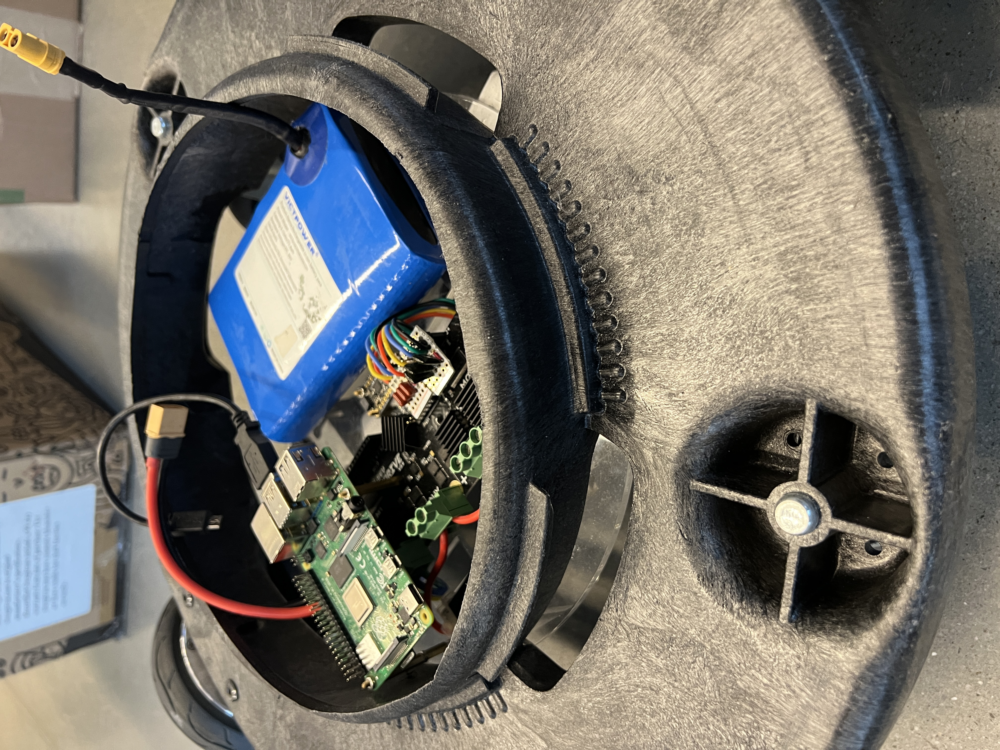
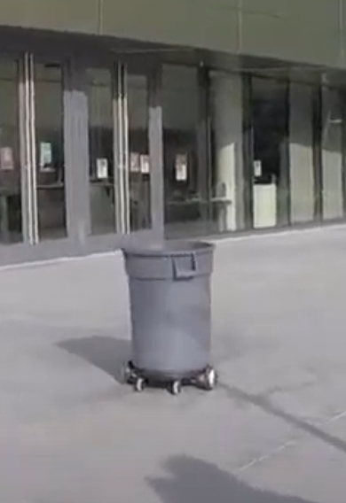
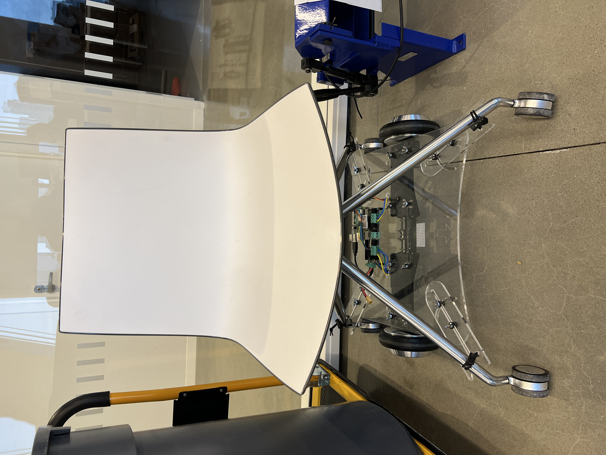
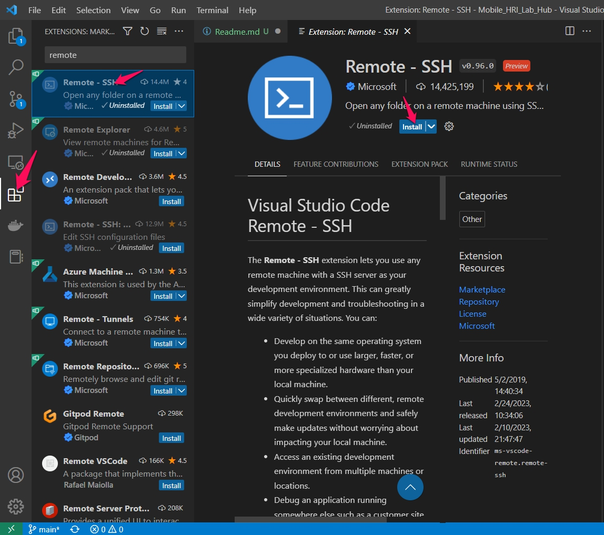
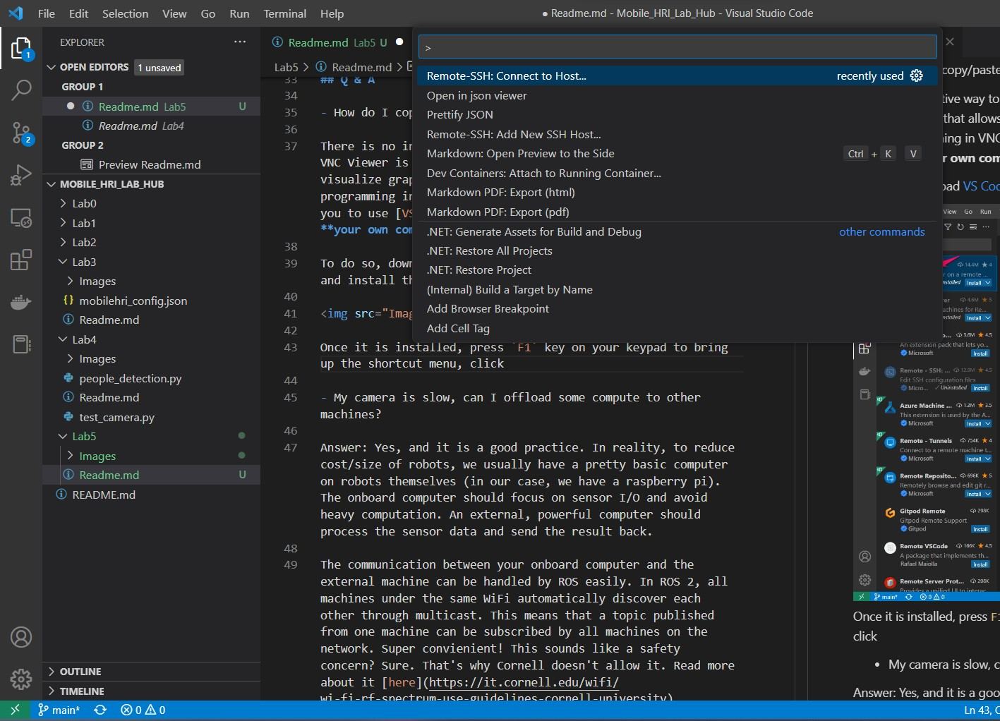
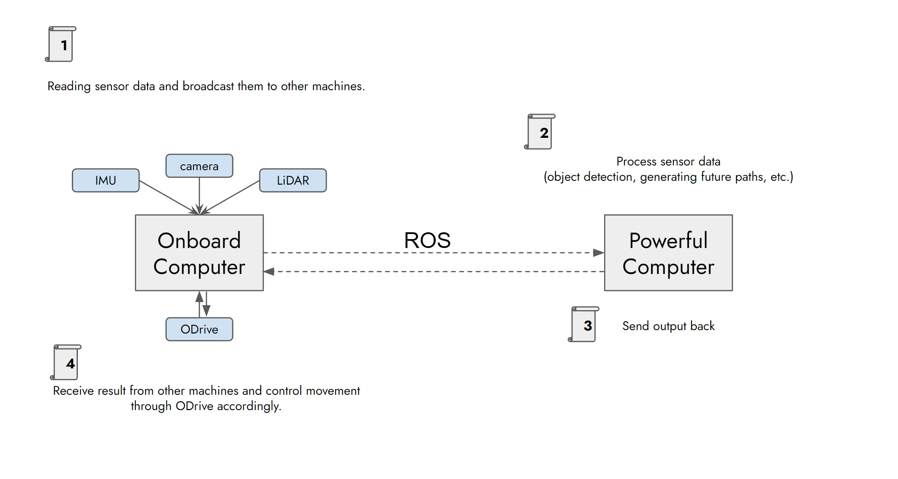

# Final Project Planning
**List the names and NetID for your partners here.**


Welcome back! Hope you had a relaxing Feburary break. We missed you. 

It's never too early to think about your final projects. You will work in teams of 3 to 5 people to automate an object of your choice. You can choose either platform for your final project: clonebot or hoverboard. 

Note: Future labs will still focus on hoverboards, and all the sensors are only tested to work with Raspberry Pi 4.

## Deliverables for this lab are:
0. A proposal for your final project. 

### Requirements
- Length: 3 pages max. Feel free to include pictures and sketches, but keep it within the 3-page limit.
- The proposal should describe only **one** robot, which your team will build for the rest of the semester.
- Be creative!

## Things to consider regarding your proposal
0. For students enrolled in 5755, you should build a robot that should also be able to interact with people (either automated or through Wizard of Oz) 
   For students enrolled in 6755, your robot should work well enough to support a research experiment, ideally with human participants or in human environments.

1. Scale the project. You cannot make an Optimus Prime with provided equipment. Think about what is essential for the kind of interactions you are interested in, and design from there. Separate your plans so that the essential-to-have bits are done first, and nice-to-have features are added if the essential parts are complete.

2. Here is a list of sensors we have for you. Feel free to discover new sensors as long as you can make them work.
    - [Pi Camera](https://www.raspberrypi.com/products/camera-module-v2/)
    - [ReSpeaker](https://wiki.seeedstudio.com/ReSpeaker_Mic_Array_v2.0/)
    - [MPU6050 IMU](https://invensense.tdk.com/wp-content/uploads/2015/02/MPU-6000-Datasheet1.pdf)
    - [YD LiDAR (2D)](https://www.amazon.com/YDLIDAR-X4-Degree-Communication-Interface/dp/B07DBYHJVQ/ref=asc_df_B07DBYHJVQ/?tag=hyprod-20&linkCode=df0&hvadid=241892646230&hvpos=&hvnetw=g&hvrand=14223220310037484520&hvpone=&hvptwo=&hvqmt=&hvdev=c&hvdvcmdl=&hvlocint=&hvlocphy=9067609&hvtargid=pla-563047874791&psc=1)
    - Hall sensors are embedded in your hoverboard wheels 

3. Hoverboard is programmed mainly in Python. Clonebot, which features a ESP32 microcontroller, is programmed in C. Describe what you expect to use for your software stack.

4. If you are modifying an existing object/furniture, consider where/how to attach the wheels, ODrive, and the battery. 

5. Remember that you need to charge your battery at some point, so do not seal it inside. 

6. Feel free to reuse the metal frame that comes with the hoverboard; we also bought plywood for you to laser cut and customize.

7. It is always good to prototype your design with cardboards first and then move to more rigid material (like plywood). This is also a good practice if you want to laser cut material. Try it with cardboards to test out shape and dimension. We don't have unlimited supply of plywood. 

8. The TAs posted some potential project candidates, platforms that want to be mobile robots, on this [Miro board](https://miro.com/app/board/uXjVPh1cE7w=/?share_link_id=887226324090). If your team wants to modify one of our existing candidates, please put a sticky note on the picture with your neams (one team per furniture). Feel free to post new ideas and sketches on the Miro board to share with your peers.

## Example
Here is a trash barrel robot we built last summer:




Here is a chairbot:




## Q & A

1. How do I copy/paste code in VNC viewer when using my raspberry pi?

If you use the on-screen menu paste functions for VNC viewer, you can paste from your local machine to VNC Viewer. (More instructions [here](https://help.realvnc.com/hc/en-us/articles/360002253738-Copying-and-Pasting-Text#copying-and-pasting-text-to-vnc-server-0-0).) That said, you should avoid programming in VNC as much as possible. Instead, we recommend you to use [VS Code](https://code.visualstudio.com/) on **your own computer** to program your Raspberry Pi remotely. 

To do so, download [VS Code](https://code.visualstudio.com/) and install the `Remote SSH` extension.



Once it is installed, press `F1` key on your keypad to bring up the shortcut menu, click 



In the prompted window, type in `mobilehri@YOUR_IP`.
Select `Linux` for your system, then enter password `student@tech`.

Once you are in, you can access files on RPi through the file tree on the left. This allows you to copy paste code to RPi. You can even open a terminal very easily.

2. My camera is slow, can I offload some compute to other machines?

Yes, and it is a common practice. In reality, to reduce cost/size of robots, we have a pretty basic computer on the robot (in our case, we have a raspberry pi). The onboard computer should focus on sensor I/O and avoid heavy computation. An external, powerful computer should process the sensor data and send the result back.



The communication between your onboard computer and the external machine can be handled by ROS easily. In ROS 2, all machines under the same WiFi automatically discover each other through multicast. This means that a topic published from one machine can be subscribed by all machines under the same network. Super convienient! Does this sound like a safety concern? Sure. That's why Cornell doesn't allow it. Read more about it [here](https://it.cornell.edu/wifi/wi-fi-rf-spectrum-use-guidelines-cornell-university).

There are two solutions forward.

- Disable multicast and force unicast.

I personally think this is better for now since this gets you on Redrover, which covers pretty much everywhere on campus. 

On your raspberry pi, create a new file named `ros2_unicast.xml`, then copy the folloing code to your file. 

```xml
<?xml version="1.0" encoding="UTF-8" ?>
<profiles xmlns="http://www.eprosima.com/XMLSchemas/fastRTPS_Profiles">
   <participant profile_name="unicast_connection" is_default_profile="true">
       <rtps>
           <builtin>
               <metatrafficUnicastLocatorList>
                   <locator/>
               </metatrafficUnicastLocatorList>
               <initialPeersList>
                   <locator>
                       <udpv4>
                           <address>ROBOT_IP</address>
                       </udpv4>
                   </locator>
               </initialPeersList>
           </builtin>
       </rtps>
   </participant>
</profiles>
```
Change the `ROBOT_IP` to the computer IP that you plan to do heavy computation (must be on the same network).

- Host your own router

In general, routers enable multicast by default. However, if you have multiple robots running at the same time, it can be difficult to figure out ownership of topics and messages. If you use your own router and host more than one robot, I recommend you to use [ROS DOMAIN ID](https://docs.ros.org/en/foxy/Concepts/About-Domain-ID.html) to seperate out individual communications. 
