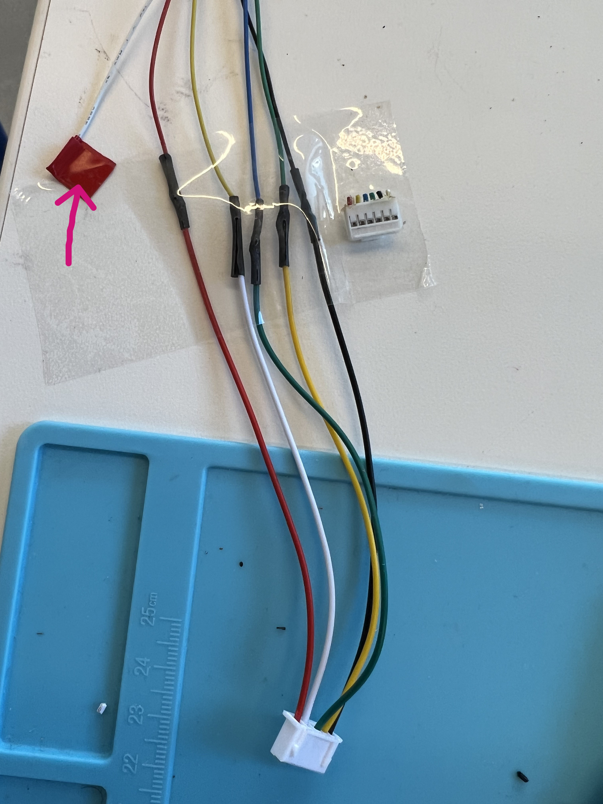
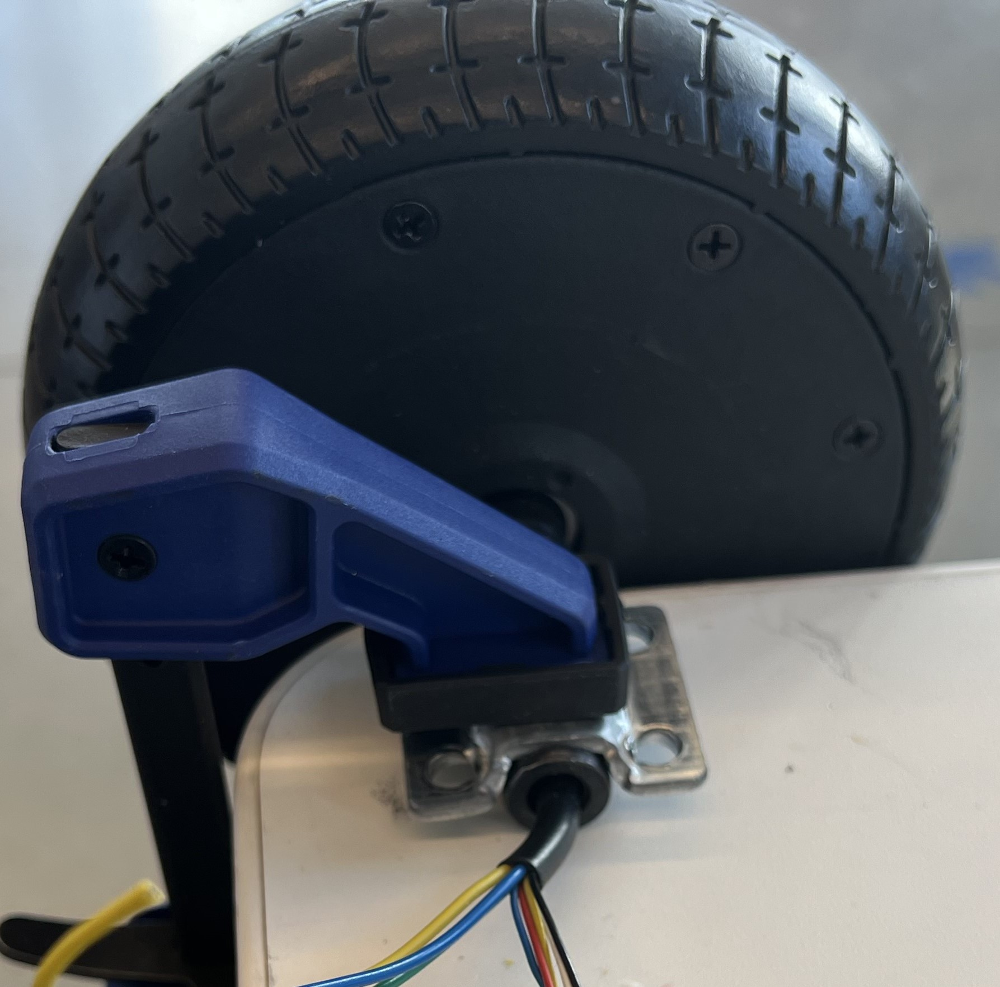
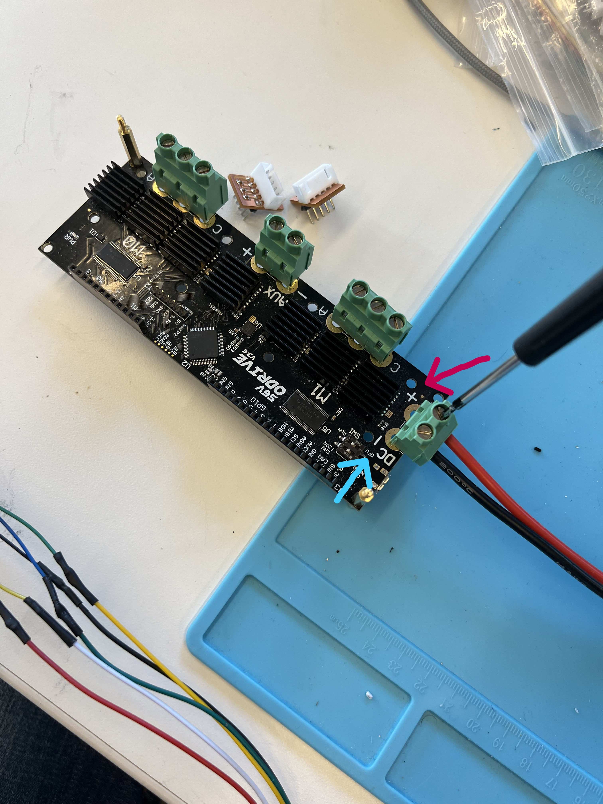
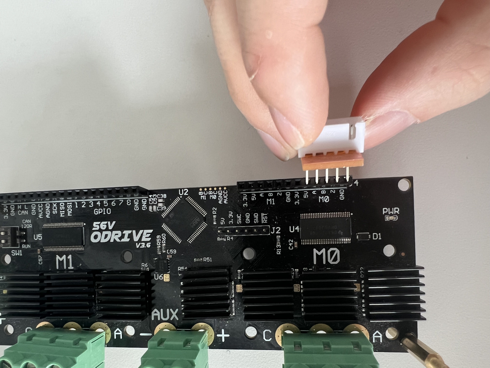
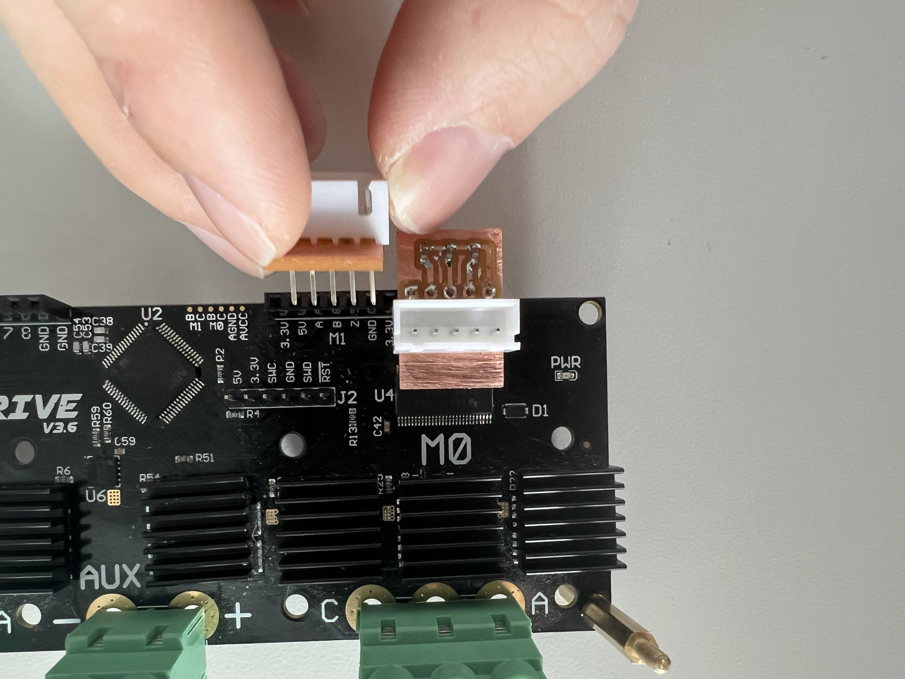
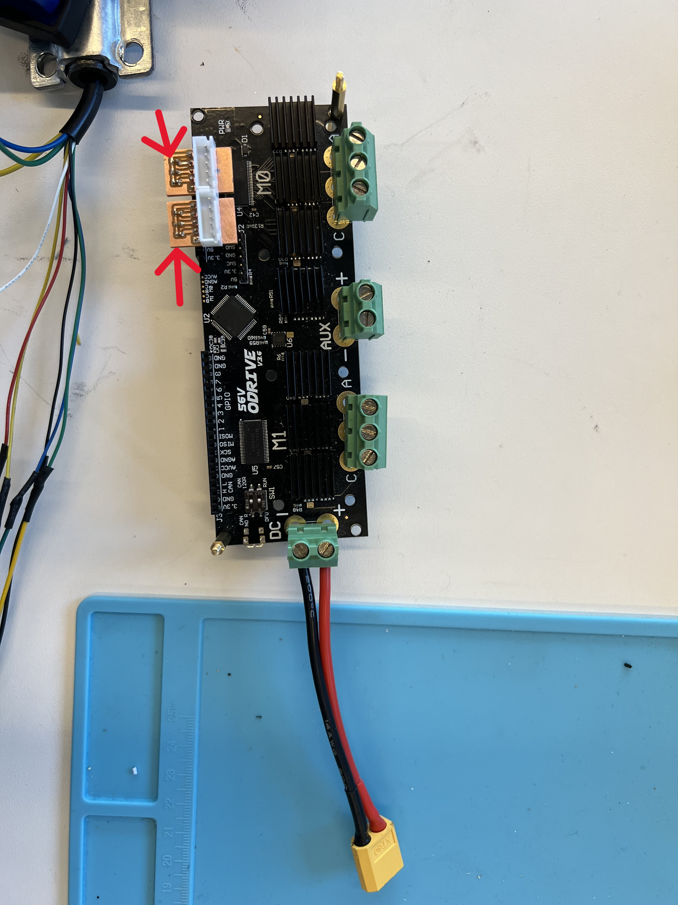
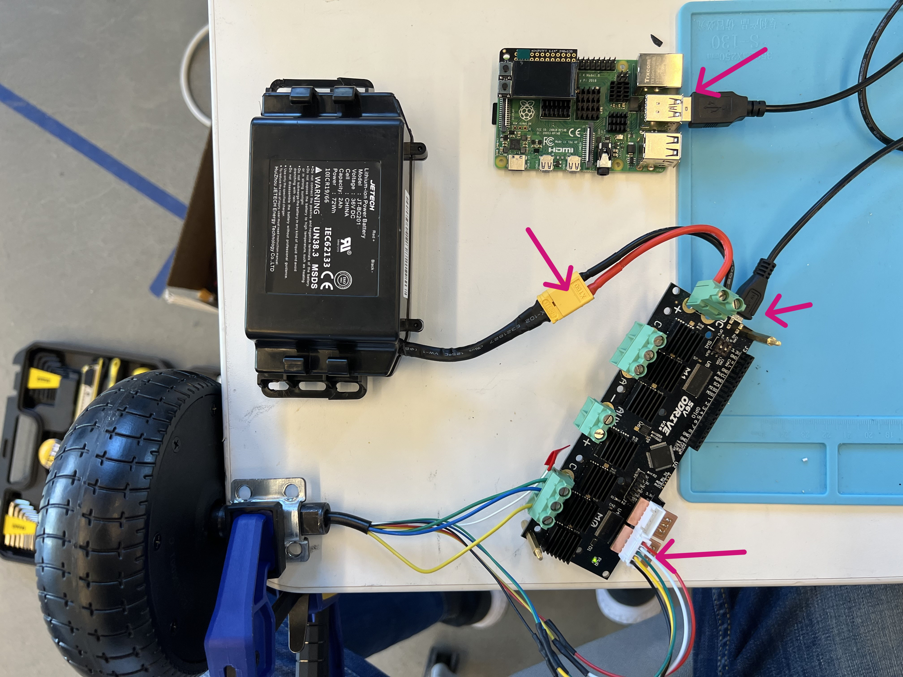
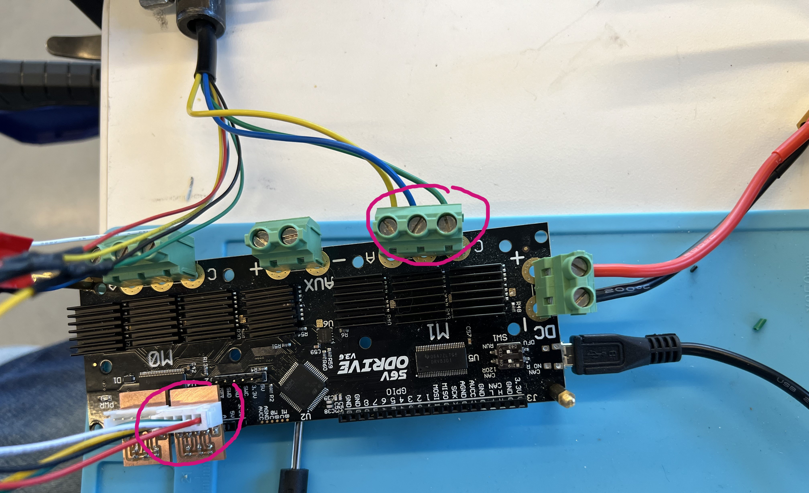

# Make the Robot Move
**List the names and NetID for your partners here.**


In this week's lab, you will lay the foundations for your mobile robot. We will control commercially available hoverboards (Dr. Ju bought these on eBay) with ODrive motor controllers. This week's lab can be challenging. Be prepared to get your hands dirty.


## Prep


Starting with this lab, form a group of 3 to 4 people (doesn't have to be the same group as in previous labs). You will work with the same team until the end of the semester.


### Before Thursday, please watch/read the following video/websites.
[Beginner's Guide on Soldering](https://www.makerspaces.com/how-to-solder/)


[How to Solder Wires Together](https://youtu.be/NSqPHQ1zQco)


### For this lab, you will need:
1.  laptop
2.  strength to take things apart


### For students in Ithaca
Please bring all items I have shipped to you to the robotics lab in Upson. You will need both the raspberry pi and the hoverboards.
- Use the [RPi Imager](https://www.raspberrypi.com/software/) to write [class image](https://drive.google.com/file/d/1PMWyJUoA-CJ73vktrp3nPKiykwzOaauU/view?usp=sharing) to the SD cards (You will need to flash one card per group). [Online Guide](https://howchoo.com/pi/raspberry-pi-imager#write-a-custom-image). Please do this before Thursday's lab.


### Deliverables for this lab are:
0. a video showing that you can control the hoverboard through python
1. three sketches of potential robots you can build with this platform. Be more realistic and think of these sketches as potential candidates for your final project. (Look around, what objects can you make mobile?)


### The Report
This README.md page in your own repository should be edited to include the work you have done (the deliverables mentioned above).


## Lab Overview
For this assignment, you are going to:


A) [Setup Raspberry Pi](#part-a-setup-raspberry-pi)


B) [Hardware Setup](#part-b-hardware-setup)


C) [Software Setup](#part-c-software-setup)


D) [Sketch Again](#part-d-sketch-again)


Labs are due on Tuesdays before class. Make sure this page is linked to on your main class hub page.


## Lab Safety
- The hoverboard metal chassis is **conductive**. **Do not place any electronics on it, including the ODrive board.** Otherwise, you will see sparks and the board will be damaged.
- Dangling wires are always dangerous. They can short your circuit in no time. Cover them with electrical tape.
- Be careful with the hoverboard battery. **Do not leave the lab with the batteries plugged into ODrive.** The ODrive will keep draining your battery even if the battery is below its nominal voltage. Your battery can be damaged permanently.
- Unplug the battery before you touch the electronics.


## Part A. Set up raspberry pi
Each team should pick up a raspberry pi (RPi), a miniTFT display, and a USB-C charger. Plugin the display as shown in the image below. Power the RPi with the provided power cable, and the screen should display device mac address after boot.


**One member of the team should register the RPi as
instructed** [here](https://it.cornell.edu/wifi-wired/register-device-doesnt-have-browser). (You need to do this even if there is an IP address displayed already.)


Reboot the RPi (unplug the power cable and replug it in). Your device should now connect to RedRover and display the correct IP address.


> 
> &nbsp; &nbsp;
> 


## Part B. Hardware setup


> ### For students in Ithaca only.
> Follow the video [here](https://drive.google.com/file/d/14AAURnUGDazZhO_vaSGaS3nCYTV7YWQE/view?usp=sharing) to take apart your hoverboard. After fully disassembling your hoverboard, please do the following
> - assemble the charger as shown in the figure below
> - cut the original connectors from the hall sensors (take a note of the wire ordering). Then, solder the JST connector to the hall effect sensors as shown below (watch the tutorial in the Prep section on how to solder two wire together, don't forget the heat shrinks.) **Pay attention to the color coding of the wires, I am sorry that they do not match exactly.**
> - Tape the dangling white wire with electrical tape. (In the picture, my tape is red.) This is important since the white wire will short your motor if left unattended.
> 
> &nbsp; &nbsp; &nbsp;
> 
> &nbsp; &nbsp; &nbsp;
> 


### For everyone
1. Take a hex key, and remove one of the wheels from your hoverboard. Clamp it down on the desk. The wheel should be **free** to spin, but the axle must be firmly clamped to the desk.


> 
> 
 
2. Pick up your ODrive from the lab cart. Take a XT60 power cable (pay attention to the shape), insert it to ODrive and tighten it with a [flathead](https://www.merriam-webster.com/dictionary/flathead%20screwdriver#:~:text=noun,its%20top%20compare%20phillips%20screwdriver) screw driver. Be careful with the polarity, **red wire connects to positive, black wire connects to negative.**


> 
> 


3. Take 2 pieces of filtering PCB and plug them in to the ODrive. The five pins should go from ground to 5V, with the red wire connecting to the 5V pin labeled on ODrive. (I made two slightly different versions of the same design, and they both should work. The only difference is that the JST connector is pointing up/down.) Note in the last figure that the capacitors are outside the ODrive board. These PCBs each has three 22nF capacitors on them that basically function as low pass filters to reduce noise. Look at this [post](https://discourse.odriverobotics.com/t/encoder-error-error-illegal-hall-state/1047/7) if you are curious about the details. 

> 
> 
> 
> 


4. Connect the ODrive with your RPi using the micro-USB cable provided in the ODrive box, and then plug the JST connector from your wheels to the filtering PCB. Now, you can also plug in the power.


> 


## Part C. Software setup
Now, let's get your motors running. Be prepared, you will run into many problems during this process for sure. Let the TAs know when you run into a problem that cannot be resolved by repeated attempts or unplugging/replugging.


We are using a motor controller board called [ODrive v3.6](https://odriverobotics.com/shop/odrive-v36) for this class. The instructions below are based on a [guide](https://docs.odriverobotics.com/v/0.5.5/hoverboard.html) provided by ODrive. To make your life easier, the teaching staff has already prepared some initial working parameters that you can just load to your ODrive.


### ssh to your raspberry pi

Since ODrive cannot be openned on multiple threads, you can only control it from one computer. However, your team should still walk through it together.

```bash
# Open a terminal on your own laptop.
# The IP address for your RPi should be displayed on the miniTFT screen.
ssh mobilehri@YOUR-IP
# Replace YOUR-IP with the ip address displayed on your screen. (e.g. ssh mobilehri@10.55.131.31)
# Say yes if prompted
# Password is `student@tech`.
```
### Download the initial parameters.
Note that your ODrive must be plugged in to the RPi with the USB cable and power on with the hoverboard battery.
```bash
# Download config file to your RPi
curl -LJO https://raw.githubusercontent.com/FAR-Lab/Mobile_HRI_Lab_Hub/main/Lab3/mobilehri_config.json
# Load the config file to your ODrive
odrivetool restore-config mobilehri_config.json
# Ignore the warnings about some parameters not being loaded. You will recalibrate the motors anyway.
```
### Program ODrive in Python.
```bash
# In the same remote session (RPi)
odrivetool
```
This will open an interactive IPython tool that communicates with your odrive board specifically. You should see something like the following:


Make sure the terminal displays `Connected to ODrive xxxxxxxx`. If the terminal does not report connected to ODrive, check your cable connections between the RPi and the ODrive. Also make sure the battery is plugged in for ODrive.


Here are some basic terminology about this tool.


> `odrv0` refers to the ODrive you are currently connected to. If multiple Odrives are connected, the index can be used to differentiate them (odrv0, odrv1, etc.).
`odrv0.axis0` and `odrv0.axis1` refer to the two axes on ODrive, each axis is used to control one hub motor/wheel. `dump_errors(odrv0)` is a handy command to show current errors.`odrv0.clear_errors()` is a useful command to reset your ODrive errors.      


### Now, let's calibrate the ODrive with the attached motors.
The purpose of this step is to figure out basic motor parameters automatically and check if any of the configurations are wrong. All commands below should run in the interactive IPython tool.


```python
# reset errors
odrv0.clear_errors()
# full calibration sequence includes motor calibration and hall encoder calibration.
odrv0.axis0.requested_state = AXIS_STATE_FULL_CALIBRATION_SEQUENCE
# Your motor should make a beeping sound, and start rotating for a few turns.
```
```python
# Once your motor stops
dump_errors(odrv0)
```


Now, check for errors under `axis0`. Ignore the errors under `axis1` for now. (There will be errors under `axis1` since no motors are attached yet.) If you see the following output, you are good to proceed.


If there are no errors, perfect! Save the parameters and reboot ODrive.
```
odrv0.save_configuration()
odrv0.reboot()
```


If you get an error regarding "HALL ENCODER STATE" under `axis0`, check if your filtering PCB is plugged in correctly. If the error persists, please let the TA know.


Now, let's try to make the wheel move.
``` python
# Remember that we talked about close loop control in class? We are using it now! Set wheel state to close loop control.
odrv0.axis0.requested_state = AXIS_STATE_CLOSED_LOOP_CONTROL


dump_errors(odrv0) # If there is an error under axis0, rerun calibration `odrv0.axis0.requested_state = AXIS_STATE_FULL_CALIBRATION_SEQUENCE`


# set velocity to 2 turns per second
odrv0.axis0.controller.input_vel = 2
# Your motor should spin now, take a note of the spinning direction of the wheel.
```
To stop the wheel, you must run the following two commands. Setting a wheel to zero velocity doesn't imply that the power is turned off. The controller is literally try to make the wheel move at 0 turn/sec. This will lock the wheel in place. Setting the state to idle disconnects wheels from power.
```python
odrv0.axis0.controller.input_vel = 0
# This is important, the hub motors are not designed to have 0 velocity (it will lock the wheels and may start shaking), so we need to change its state to IDLE immediately.
odrv0.axis0.requested_state = AXIS_STATE_IDLE
```


### Calibrate again
Remember that you have two wheels?


Repeat the procedure for the other wheel. As before, clamp the wheel firmly on the desk. This time, plug your new wheel to axis 1. The changes are highlighted in the figure below. **Don't forget to unplug your battery first before you swapping out the wheel!**





Repeat the calibration process above, note that you should change all occurance of `axis0` to `axis1`!


```python
# reset errors
odrv0.clear_errors()
# full calibration sequence includes motor calibration and hall encoder calibration.
odrv0.axis1.requested_state = AXIS_STATE_FULL_CALIBRATION_SEQUENCE
# Your motor should make a beeping sound, and start rotating for a few turns.
```
```python
# Once your motor stops
dump_errors(odrv0)
```
Now, check for errors under `axis1`. This time, ignore the errors under axis0.


If there are no errors, save the parameters and reboot ODrive.
```
odrv0.save_configuration()
odrv0.reboot()
```
If you get an error regarding "ILLEGAL HALL ENCODER STATE", check if your filtering PCB is plugged in correctly. If the error persists, let the TA know.
Now, let's try to make the wheel moving
``` python
# set wheel state to close loop control
odrv0.axis1.requested_state = AXIS_STATE_CLOSED_LOOP_CONTROL
dump_errors(odrv0) # If there is an error under axis0, rerun calibration `odrv0.axis0.requested_state = AXIS_STATE_FULL_CALIBRATION_SEQUENCE`


# set velocity to 2 turns per second
odrv0.axis0.controller.input_vel = 2
# Your motor should spin now, take a note of the spinning direction of the wheel.
odrv0.axis1.controller.input_vel = 0
odrv0.axis1.requested_state = AXIS_STATE_IDLE
```


### Part D. Sketch Again
Now that you are aware of the dimensions of the motors and the hoverboard base, create 3 sketches of potential robot forms your team wants to build.
Look around and see what you can automate. Keep the following points in mind.
- Feel free to use the original metal plate as a supporting structure, but you can attach the wheels to pretty much anything you want.
- As we discussed in class, be mindful of the placement of the wheels. Don't make a robot fall on people.
- Your robot will interact with people eventually.

Check Canvas discussion channel "Final Project Ideas" for ideas. We posted some of our proposals.


### Again, deliverables for this lab are:
0. a video showing that you can control the hoverboard through python (functional checkoff. This is just to make sure you have a working set of hardware.)
1. three sketches of potential robots you can build with this platform (what furniture can you automate?)


