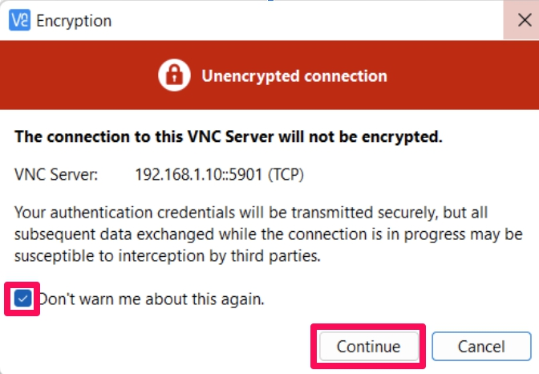
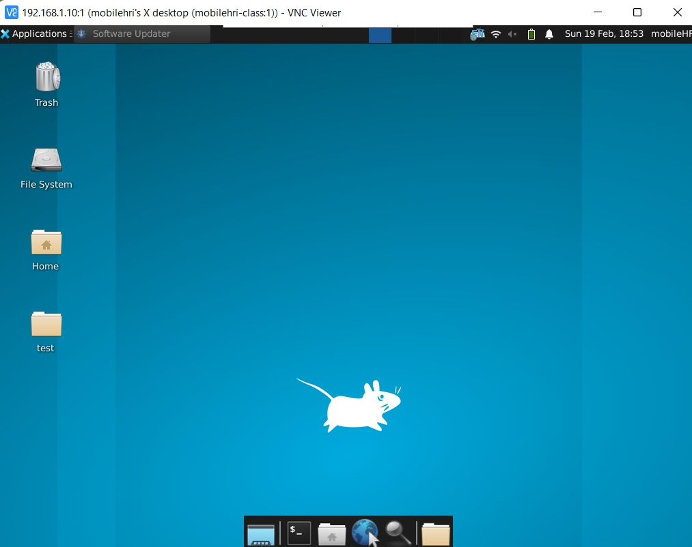
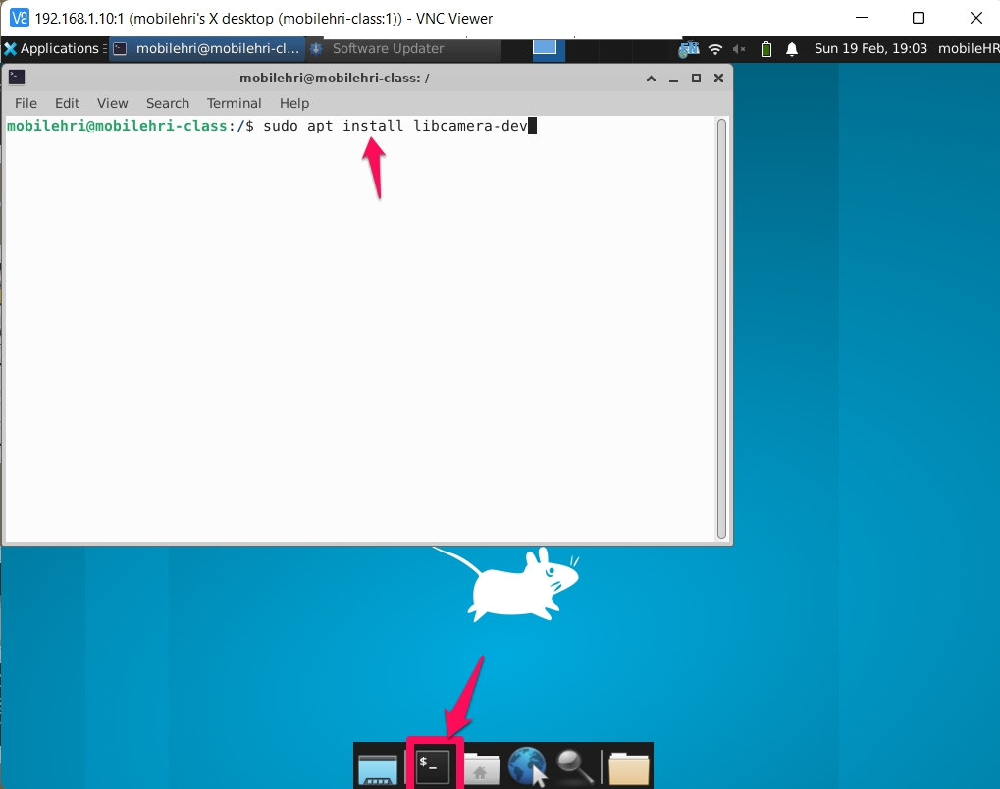

# Make the robot see
**List the names and NetID for your partners here.**

Continue Lab 3 from last week. This week's material can be done rather quickly.


## Prep

### For this lab, you will need:
1. Your laptop

### Before you come to the lab on Thursday, please do the following:
1. install vnc viewer from [here](https://www.realvnc.com/en/connect/download/viewer/) if you haven't. 

### Deliverables for this lab are: 

1. 

### The Report 
This README.md page in your own repository should be edited to include the work you have done (the deliverables mentioned above). Following the format below, you can delete everything but the headers and the sections between the **stars**. Write the answers to the questions under the starred sentences. Include any material that explains what you did in this lab hub folder, and link it in your README.md for the lab.

## Lab Overview
For this assignment, you are going to:

A) [Connect your camera](#part-a-connect-your-camera)

B) [Connect to your Pi (VNC Viewer)](#part-b-connect-to-your-pi-through-vnc-viewer)

C) [People Detection](#part-c-people-detection)

Labs are due on Tuesdays before class. Make sure this page is linked to on your main class hub page.

## Part A. Connect your camera
Plug in the Pi camera to your RPi.

## Part B. Connect to your Pi through VNC Viewer
Start VNC Viewer, if prompted to sign in, "select Use VNC without signing in" in the bottom.

In the text box "Enter a VNC Server address or search", type in `Your_RPi_IP:1` (e.g. `10.56.131.31:1`).
> When prompted "server not encrypted", click "continue"


**Password**: `student`

You should now log in to your Pi through VNC Viewer.

> 

Open a terminal, install `libcamera-dev`.

```bash
sudo apt install libcamera-dev
```
> 

## Part C. People Detection


\*\***Document everything here. (Particularly, we would like to see the storyboard and video, although photos of the prototype are also great.)**\*\*

Labs are due on Tuesdays before class. Make sure this page is linked to on your main class hub page.

### Again, deliverables for this lab are: 

0. 
