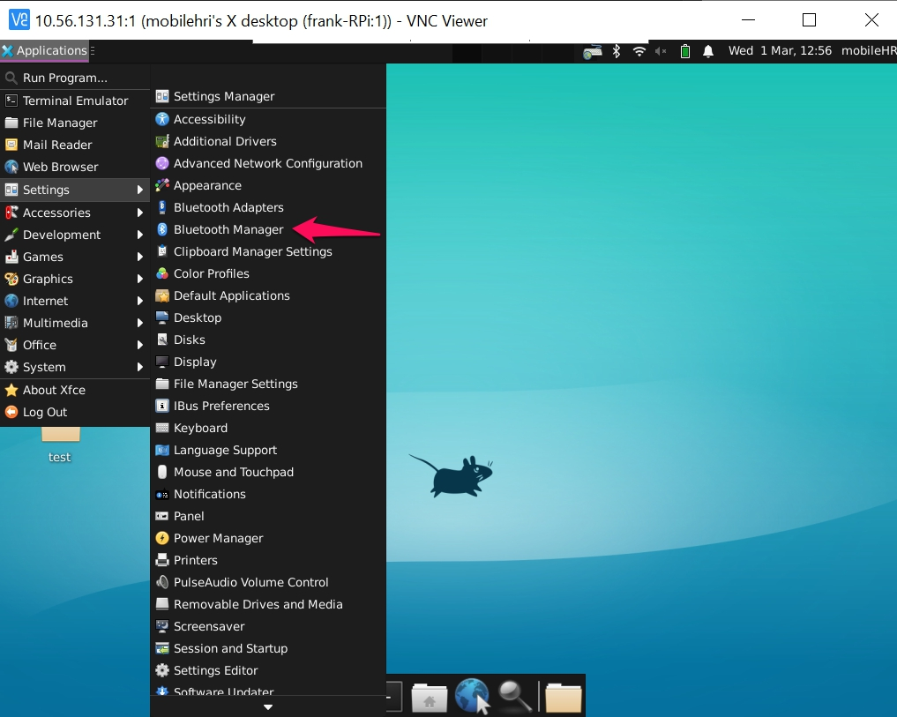
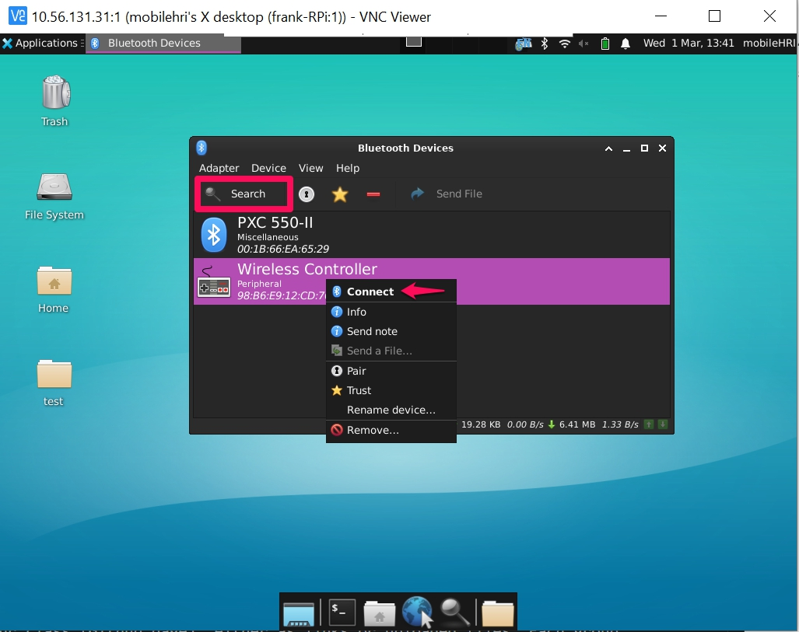
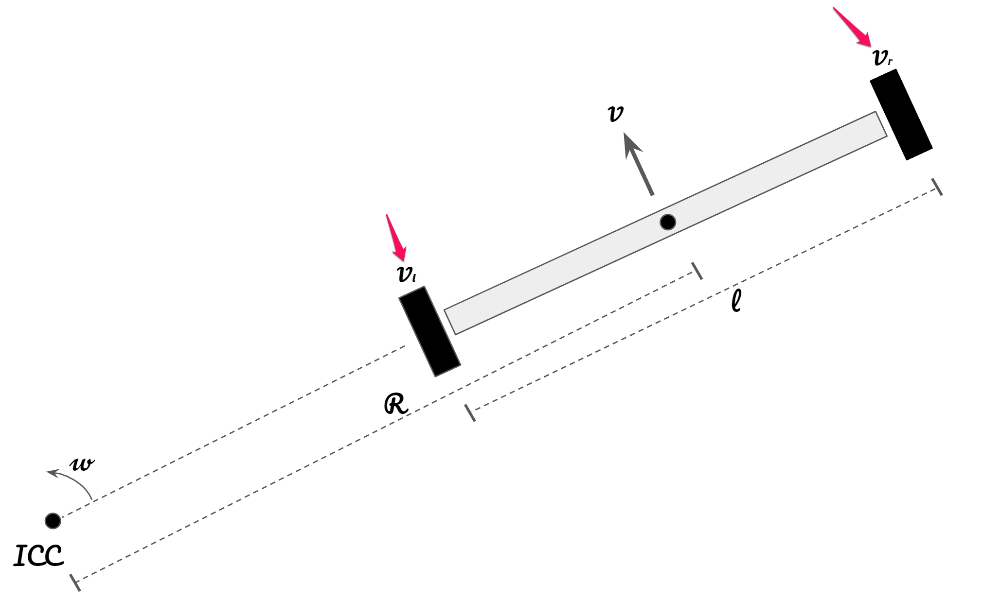

# Give the robot moves
**List the names and NetID for your partners here.**

Now, let's control our robots to make them move intuitively. 

As you have seen, it's pretty easy to control the wheels with Python! However, it's not easy for us as humans to move the robot in ways that feel right while thinking in terms of individual wheel velocity. If you are a gamer, you might be pretty familiar with controlling avatars with joystick controllers or keyboard keys (WASD). In today's lab, let's map joystick controller commands to wheel velocities in Python.

## Prep

### For this lab, you will need:
1. Your Computer
2. Joystick Controller
3. Your set of hoverboard + ODrive
4. (optional) Cardboard to make the proto-chassis for your robot

### Deliverables for this lab are: 

1. Videos of you controlling the wheels with your joystick controller properly.
2. Three ideas on how to use controllers' rumble feature for Wizard of Oz control.
3. (optional) Documentation of the robot proto-chassis

### The Report 
This README.md page in your own repository should be edited to include both the work you have done, and your thinking behind the work(the deliverables mentioned above). Following the format below, you can delete everything but the headers and the sections between the **stars**. Write the answers to the questions under the starred sentences. Include any material that explains what you did in this lab hub folder, and link it in your README.md for the lab.

## Lab Overview
For this assignment, you are going to:

A) [Connect Joystick Controller to RPi](#part-a-connect-joystick-controller-to-RPi)

B) [Read Messages from Joystick](#part-b-read-messages-from-Joystick)

C) [Make it rumble](#part-c-make-it-rumble)

D) [Map buttons to control](#part-d-map-buttons-to-control)

E) [Try it with your hoverboard!](#part-e-try-it-with-your-hoverboard!) 

F) (optional) [Mount your wheels to a prototype chassis](#part-f-mount-your-wheels-to-chassis)

Labs are due on Tuesdays before class. Make sure this page is linked to on your main class hub page.

## Part A. Connect Joystick Controller to RPi
Our wireless joystick controller connects to RPi through Bluetooth. 

If you are an old school terminal person, you can register your joystick through the command line via `bluetoothctl`([tutorial](https://www.makeuseof.com/manage-bluetooth-linux-with-bluetoothctl/)).

It is much easier to pair a bluetooth device in VNC viewer. 
1. Login to VNC viewer.
2. Setup bluetooth. 
Open a terminal on your RPi.
```bash
sudo apt install bluez*
sudo apt install blueman # not the musical group, it is short for bluetooth management. 
```
3. Open bluetooth management

4. Open your joystick controller and boot it to wireless pairing mode. Instructions are printed on the back of the box.
5. While your controller is double-flashing, click the search button in the bluetooth manager. You should be able to find your controller.  Right-click on the controller and select Connect. Once connected, your controller LED should turn blue.


## Part B. Read Messages from Joystick
Now, you have successfully paired your controller with your RPi. Let's access the values from the Joystick through ROS 2.

Open a terminal (either in VNC viewer or a local terminal that ssh to your RPi)
```bash
ros2 run joy joy_node
# You should see somthing like the following:
# [INFO] [1677696499.194657745] [joy_node]: Opened joystick: Wireless Controller.  deadzone: 0.050000
```
ROS 2 comes with a default package, `joy`, to communicate with joystick controllers. Recall that in Lab 0, you wrote your own publisher to publish a string under the topic `hri_topic`. The Joy package reads values from your controller and publishes your input under a specific topic. `joy_node` is the name of the executable that is actually linked to the underlying python script. They are defined in the `setup.py`. Now, let's find out which topic the joystick sends messages to!

<details closed>
<summary>More on `joy_node`</summary>

Recall in lab 1, where we turned your code from Lab 0 into Lab 1, we had the following script. 
```python
from setuptools import setup

package_name = 'my_package'

setup(
    name=package_name,
    version='0.0.0',
    packages=[package_name],
    data_files=[
        ('share/ament_index/resource_index/packages',
            ['resource/' + package_name]),
        ('share/' + package_name, ['package.xml']),
    ],
    install_requires=['setuptools'],
    zip_safe=True,
    maintainer='user',
    maintainer_email='user@todo.todo',
    description='TODO: Package description',
    license='TODO: License declaration',
    tests_require=['pytest'],
    entry_points={
        'console_scripts': [
            'talker = my_package.hri_publisher:main',       # NEW!
            'listener = my_package.hri_subscriber:main',    # NEW!
        ],
    },
)
```
In the `entry_point` section, we defined two entry points, `talker` and `listener` to the main functions we wrote in Python files. We are basically creating a shortcut for ROS 2 to find our code easily. Of course, we can also execute those functions directly through the command `python3` instead of `ros2`. This is just a good practice, to keep your code clean.
</details>

Leave the previous terminal running, and open a new terminal window:
```python
ros2 topic list
# You should see the following
''' 
/joy
/joy/set_feedback
/parameter_events
/rosout
'''
```
Let's see what's actually being published under the topic `/joy`. We will talk about `/joy/set_feedback` later. In the same terminal, enter
```
ros2 topic echo /joy
```
A lot of things are printing to the screen! Since the node is continuously publishing the message, I just copied one message below to demonstrate. **Try pressing different buttons and turning different knobs on the controller to see what changes. You should see something like: **
```
---
header:
  stamp:
    sec: 1677700131
    nanosec: 527338319
  frame_id: joy
axes:
- -0.0
- -0.0
- 1.0
- -0.0
- -0.0
- 1.0
- 0.0
- 0.0
buttons:
- 0
- 0
- 0
- 0
- 0
- 0
- 0
- 0
- 0
- 0
- 0
- 0
- 0
---
```

As you can see, all axes values are **continuous floats**, and all button values are **binary integers**. This is why we use joystick to control continous transitions, such as movement of avatars, and use buttons to toggle binary state. In python, `axes` and `buttons` are just arrays, which you can easily index into to select which button or joystick you are interested in. We will talk more about this in the next lab.


## Part C. Make it rumble!
Modern joystick controllers are not just simple input devices. They can also provide feedback to Wizard-users through haptic vibration (pretty common in shooting or racing games). In fact, tactile feedback can also carry rich information and is already ubiquitous (e.g. your phone provides plenty of tactile feedback to you).

If you are interested in controlling your robot through Wizard-of-Oz, it is worth considering what feedback you want to provide to the wizard. Of course, visual feedback is always important: the wizard needs to see the surroundings of the robot they are controlling. Beyond that, a touch of vibration would make the whole interaction more interesting. For example, you can make the joystick rumble when a person is near the robot.

To make the controller rumble, we will make use of the `/joy/set_feedback` topic. You have seen it earlier when you ran `ros2 topic list`. It is also provided by the `Joy` package. First, let's check out what kind of message this topic is expecting. We can use the command `ros2 topic info [TOPIC_NAME]` to inspect any active topic.

```bash
ros2 topic info /joy/set_feedback
# Type: sensor_msgs/msg/JoyFeedback
# Publisher count: 0
# Subscription count: 1
```
From returned information, we learned that this topic is expecting a sensor message of type `JoyFeedback`. Currently, no node is publishing on this topic, but there is one subscriber.

So, what's up with the JoyFeedback message? Let's see how it is [defined](http://docs.ros.org/en/api/sensor_msgs/html/msg/JoyFeedback.html).

Just in case you don't feel like clicking on the link above, I copied the message definition below. 
```bash
# Declare of the type of feedback
uint8 TYPE_LED    = 0
uint8 TYPE_RUMBLE = 1
uint8 TYPE_BUZZER = 2

uint8 type

# This will hold an id number for each type of each feedback.
# Example, the first led would be id=0, the second would be id=1
uint8 id

# Intensity of the feedback, from 0.0 to 1.0, inclusive.  If device is
# actually binary, driver should treat 0<=x<0.5 as off, 0.5<=x<=1 as on.
float32 intensity
```
A JoyFeedback message contains three field, type, id, and intensity. The type parameter specifies what kind of feedback we are dealing with. In our case, we want `TYPE_RUMBLE`. When we have multiple feedback devices, we want to specify which device we are talking about through `id`. We can go with default 0 for now. Note that intensity is defined as a number between 0 and 1. 

Now, let's publish some messages to the topic `/joy/set_feedback`. To be honest, I feel lazy now. I don't want to write an entire package, like what we did in Lab0, to publish a simple string. I want a quick-and-dirty way to debug and prototype. Luckily, ROS comes with plenty of command-line tools to make our lives easier. 

To publish messages to a topic through command line, use the following syntax:
```
ros2 topic pub [Frequency] [Topic Name] [Message Type] [Content]
```

In the following command, I am saying to publish message `"{type: 1, id: 0, intensity: 0.9}"` to `/joy/set_feedback` at 10 Hz. The message is of type `sensor_msgs/msg/JoyFeedback`.
```
ros2 topic pub -r 10 /joy/set_feedback sensor_msgs/msg/JoyFeedback "{type: 1, id: 0, intensity: 0.9}"
```

Try it! Make your controller rumble!

** **Come up with three ways where the rumble feature can benefit WoZ deployment or other applications. Describe these in your deliverables.** **

## Part D. Map buttons to control
I have written some code that subscribe to the `/joy` topic and publish a [twist](http://docs.ros.org/en/lunar/api/geometry_msgs/html/msg/Twist.html) message accordingly. A twist message consists of two vectors, one represents linear velocity and one represents angular velocity.

Now, clone the ROS 2 code base.
```bash
# On RPi
cd ~
mkdir -p ~/mobilehri_ws/src
cd ~/mobilehri_ws/src
git clone https://github.com/FAR-Lab/mobilehri2023.git 
cd ~/mobilehri_ws
colcon build
# Ignore the warnings. You should see the following.
# Summary: 3 packages finished [16.5s]
# 3 packages had stderr output: joy_teleop_keymapping mobile_robot_control picamera
```
Take a look at `~/mobilehri_ws/src/mobilehri2023/joy_teleop_keymapping/joy_teleop_keymapping/keymapping_node.py`.
Pay attention to how the values are accessed from joystick controller and map to a twist message. 
```
source install/setup.bash
ros2 launch joy_teleop_keymapping mapping_launch.py
```
We start two nodes, the `joy` node from the previous section, and a `keymapping` node (that I wrote) to map joystick commands to twist messages (under `/cmd_vel`). We only concern overselves with the forward x-axis of linear velocity and upward z-axis of the angular velocity. (Why? Think about all the possible movements of a hoverboard.) 
```
# In a new terminal
ros2 topic echo /cmd_vel
# Hold down L1 button, then play with your joysticks to see what happens.
```
We defined the L1 button to be the safety button to avoid unintentional control, this is a simple `if` statement in the code.

> Feel free to customize my code (`~/mobilehri_ws/src/mobilehri2023/joy_teleop_keymapping/joy_teleop_keymapping/keymapping_node.py`) however you want. There are so many buttons and triggers on the controller, be creative!

## Part E. Try it with your hoverboard!
Let's do some math! (This is probably the only math you will do all semester, so a highlight of the course.) In the previous step, we mapped joystick controller commands to a message type called twist (mainly linear velocity and angular velocity). We need another layer of computation to convert twist to commands that ODrive understands (angular velocity for wheels on each axis). Imagine the following simplified diagram. 

In this problem, the following variables are known
- $v$: robot linear velocity 
- $w$: robot angular velocity
- $l$: wheel track distance (distance between the wheels)
- $r$: wheel radius (not shown in the diagram)



When the hoverboard is moving in a straight line (forward/backword), the control is pretty straight forward. When the hoverboard is turning, the hoverboard must rotate about a point, Instantaneous Center of Curvature (ICC), that lies along the common left and right wheel axis (as shown above). (When the robot is moving in a straight line, Instantaneous Center of Curvature is infinitely distant)

The following variables are unknown (or difficult to track)
- $R$: radius for $ICC$
- $v_l$: what we need
- $v_r$: what we need

The key equation we need here is the relation between linear velocity and angular velocity, which we all learned at some point in physics. 
$v = wr$. Or  $w = \frac{v}{r}$. Linear velocity is the product of angular velocity and radius.

With that, we can easily express $v_l$ and $v_r$ as the following,
```math
v_l = w(R - \frac{l}{2}) = wR - \frac{lw}{2} 
```
```math
v_r = w(R + \frac{l}{2}) = wR + \frac{lw}{2}
```

Note that $v = wR$, so we can rewrite the above equations as the following
```math
v_l = wR - \frac{lw}{2}  = v - \frac{lw}{2} 
```
```math
v_r = wR + \frac{lw}{2}  = v + \frac{lw}{2}
```
Great! We get rid of $R$ in our equation, which we don't have access to in real time.

One last step, we need to convert individual wheel velocity to  angular velocity. We need to apply the magic equation again, but this time with wheel radius. I am going to abuse the symbol $v_l$ and $v_r$ here since that's what I used in the python code.
```math
v_l = (v - \frac{lw}{2})/r
```
```math
v_r = (v + \frac{lw}{2})/r
```

**TODO**: Complete the code in `~/mobilehri_ws/src/mobilehri2023/mobile_robot_control/mobile_robot_control/odrive_command.py` with the computation we just did. I strongly recommend you to use VS Code to code (check previous lab for details). Your **TODOs** are on line 54 and 74. For now, you don't need to make changes for wheel track distance, but you need to after you made your own robot.

Wheel track distance is renamed as `self.wheel_track`. In the future, change the wheel track distance to match your own robot. 

```bash
# On RPi
cd ~/mobilehri_ws
colcon build
```

Now, try it out with your robot! Hook up both wheels to ODrive and connect to power (if the cable is too short, one wheel is okay for now).

```
source install/setup.bash
ros2 launch mobile_robot_control mobile_robot_launch.py
```

<details closed>
<summary>What is `ros2 launch`?</summary>
As your system scales up, you will run many nodes and define many parameters.
ROS 2 launch files are designed to help you organize your program execution and make start up process efficient.

If you take a look at `mobile_robot_launch.py` in `mobile_robot_control/launch/`, you will notice that we started three nodes in this file. If we do not have this launch file, we need to open three terminals and run `ros2 run` on each node.
    
The `joy_node` reads in controller commands, the `joy_teleop_keymapping_node` map controller commands to twist message (under topic `cmd_vel`), and the `mobile_robot_control_node` convert twist messages to individual wheel velocity through the math derivation above.

</details>

Now, press and hold `L1` on your controller and play with the two joysticks. Hopefully your wheels will start spinning now!
## Part F. Mount Your Wheels To Chassis
(Optional, but will be required by next week if you don't get to it)

Using the honeycomb cardboard, hot-glue and zip ties, mount the hub motor wheels to a robot chassis so that you can control the robot while it rolls around on the ground. 

Include pictures/videos of your moving robot chassis.

### Again, deliverables for this lab are: 

1. Videos of you controlling the wheels with your joystick controller properly.
2. Three ideas on how to use controllers' rumble feature for Wizard of Oz.
3. (optional) Documentation of the robot proto-chassis
