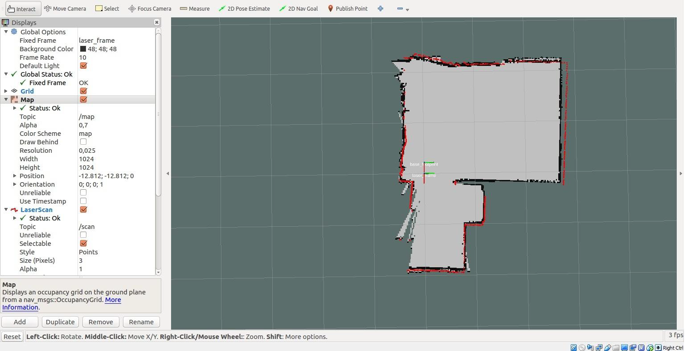

# Optional Material

For the rest of the class, you should be working on your final project. This document provides pointers on some enrichment topics that I think might interest you. If you have some spare time, feel free to try them out. There are no required deliverables for this document, but we are also excited to learn about what you accomplish. Let me know if there are any other topics that you want to learn about, and I am happy to add a section about them here.

## Overview

A) [How to create a map?](#part-a-how-to-create-a-map)

B) [Use Unity to Stage Interactions](#part-b-use-Unity-to-Stage-Interaction)

## Part A. How to create a map?
In the lecture on localization and planning, we made the assumption that a map is given. You may wonder, where do we get those high-accuracy maps?
In robotics, maps are usually generated from Simultaneous Localization and Mapping (SLAM) algorithms. There are plenty of LiDAR SLAM algorithms out there these days. More recently, visual SLAM has become popular due to the improvement of depth cameras. (The latest iPhones have built-in LiDARs and cameras, and you can use Apps to do SLAM on your phone!)

For our mobile robots, we provided a 2D LiDAR for you. We can use the LiDAR scan and wheel odometry (already available in our code) to create a 2D map like the following:

The white area represents the navigatable area, and obstacles are represented in black. (Once you have the map, if it is noisy, you can manually edit it in Photoshop or other photo editing apps. It is just an image with some coordinates saved in a metafile.)

The tutorial on ROS 2 SLAM can be found [here](https://navigation.ros.org/tutorials/docs/navigation2_with_slam.html).

You may need to remap the topic names from algorithm default to our tpoic names (topic for LiDAR and odometry), but the process is pretty automated already.

## Part B. Use Unity to Stage Interactions
[Unity3D](https://unity.com/) is a game engine for game and VR application development. They recently released a package to incorporate ROS as an endeavor to become a simulator for robotics.

If you are interested, check out the [Unity Robotics Hub](https://github.com/Unity-Technologies/Unity-Robotics-Hub) package.

Note that,
1. you do not need to install ROS on your machine running Unity. Unity Robotics plugin is able to run both ROS 1 and ROS 2.

2. In a nutshell, Unity Robotics Hub enables you to connect Unity with other machines running ROS 1/2.

Some cool things you can do with this is to blend reality and your game/VR applications. You can drive a real robot in real life and sync it with your application in games/VR headsets.

Check out tutorials [here](https://github.com/Unity-Technologies/Unity-Robotics-Hub/blob/main/tutorials/ros_unity_integration/README.md)!

